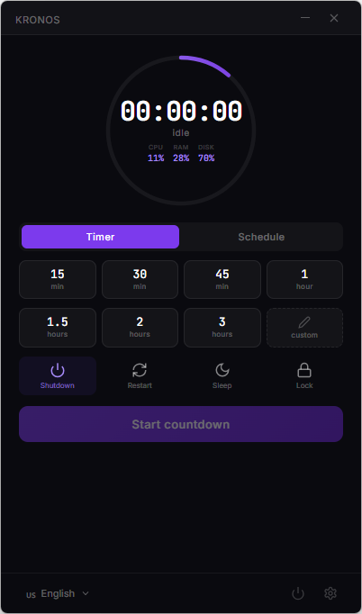
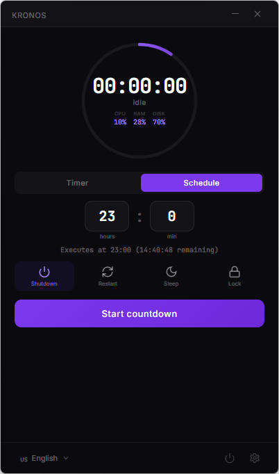
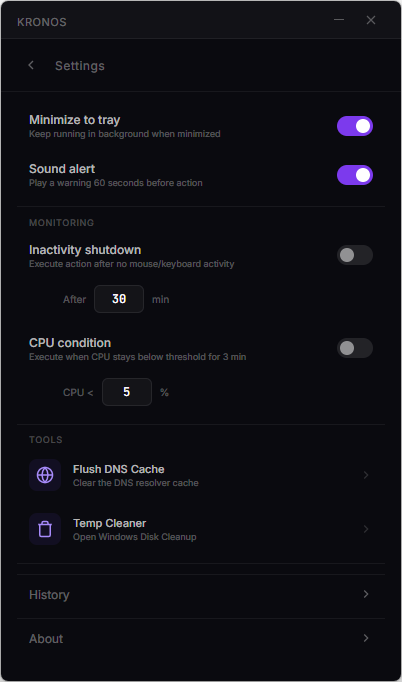
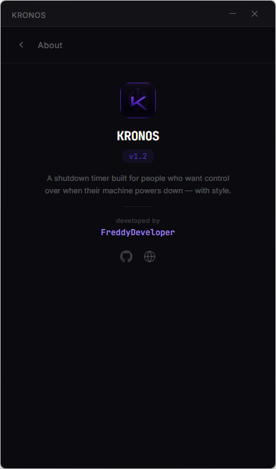

# KRONOS Shutdown v1.2

A shutdown timer built for people who want control over when their machine powers down — with style.

## Download

👉 [Download KRONOS v1.2 (Windows)](https://github.com/FreddyDeveloper/kronos/releases/latest)

## Features

- Timer with 8 presets or custom duration
- Schedule shutdown by exact time
- Real-time CPU, RAM, and Disk monitoring
- Auto-shutdown on inactivity
- Auto-shutdown when CPU drops (task finished)
- Quick power menu (instant shutdown, restart, sleep, lock)
- Built-in tools: DNS flush, Disk Cleanup
- 5 languages: English, Spanish, German, Japanese, French
- Sound alert before action
- Action history log

## Screenshots

## User Guide

📄 [KRONOS v1.2 User Guide (PDF)](KRONOS_v1.2_User_Guide.pdf)

## License

© 2026 FreddyDeveloper. All rights reserved.

This software is free for personal use. Source code is not available.

Redistribution or modification is not permitted.

---

**by [FreddyDeveloper](https://freddydeveloper.com)**
